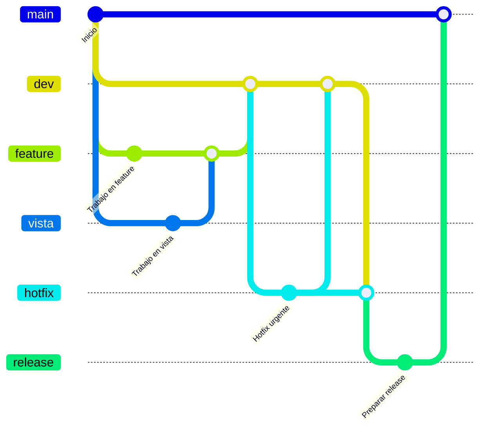

```mermaid
gitGraph
   commit id: "Inicio"
   branch dev
   checkout dev
   branch feature
   branch vista
   checkout feature
   commit id: "Trabajo en feature"
   checkout vista
   commit id: "Trabajo en vista"
   checkout feature
   merge vista
   checkout dev
   merge feature
   branch hotfix
   checkout hotfix
   commit id: "Hotfix urgente"
   checkout dev
   merge hotfix
   checkout hotfix
   merge dev
   branch release
   checkout release
   commit id: "Preparar release"
   checkout main
   merge release
```
