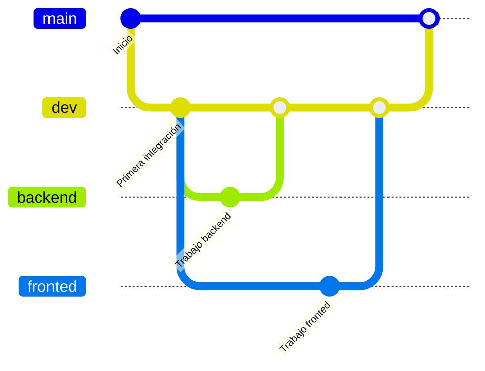

```mermaid
gitGraph
   commit id: "Inicio"
   branch dev
   checkout dev
   commit id: "Primera integración"
   branch backend
   branch fronted
   checkout backend
   commit id: "Trabajo backend"
   checkout dev
   merge backend
   checkout fronted
   commit id: "Trabajo fronted"
   checkout dev
   merge fronted
   checkout main
   merge dev
```
